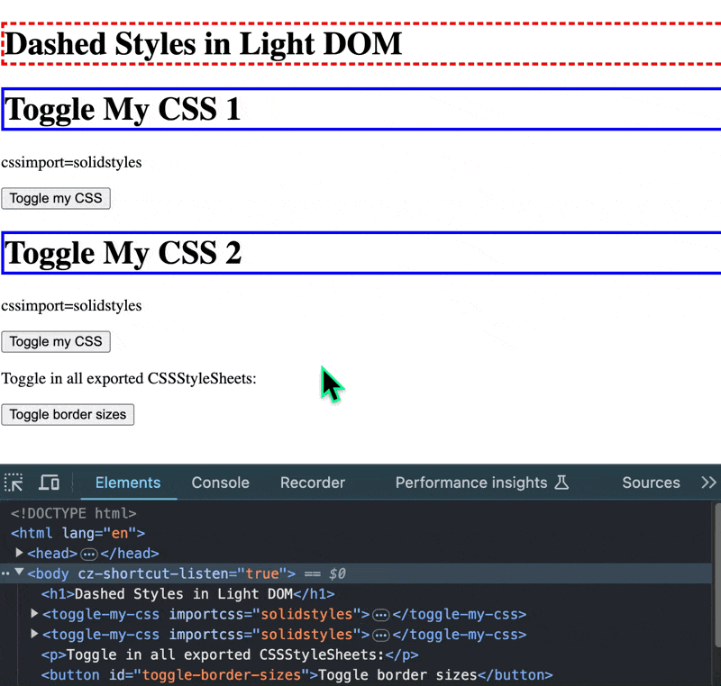

# Declarative Imports

## Purpose

Demonstrate using CSS modules identified with import maps to import the CSSStylesheets in those CSS modules into declarative shadow DOMs with adoptStylesheets(), including:

- toggling a cssimports property on the host element
- modifying a CSSStylesheet applies globally

## Demo



## Context 

The issue "[Declarative CSS Modules and Declarative Shadow DOM](https://github.com/whatwg/html/issues/10673)" in the whatwg/html repository addresses the problem that developers using Declarative Shadow DOM (DSD) lack an efficient method to share declarative stylesheets without scripts. 

Existing solutions, such as duplicating inline styles, using `<link>` tags, or the adoptedStyleSheets property, have significant limitations. 

The proposed solution introduces Declarative CSS Module sharing, which defines and uses stylesheets stored in the global Module Map, and an adoptedstylesheets attribute on the `<template>` element to allow DSD elements to share these stylesheets via module syntax. 

The issue includes a proposed syntax and highlights the need for a more efficient and script-free approach to sharing styles between shadow roots.

Comments have raised several topics:

- Concerns are raised about the `specifier=""` attribute and suggested using the `id=""` attribute instead for simplicity.
- There may be a need for a more generalized solution or avoiding manipulation of the module map entirely.
- Mutability of the specifier attribute itself raises the question of whether that is necessary or feasible
- There is a need to think through how this proposal would work with import maps.
- Possible alternatives might include hoisting shared stylesheets into the global space or using new syntax (e.g., `globalid=""`).

## Observations

Here is a thought-exercise repo that demos using import maps, which already in Chrome support CSS modules from files and (could?) sidestep or at least scope the specifier attribute issue, while also providing the necessary capabilities of a mutable adopt attribute, modifiable stylesheets, and a working import().

```html
<script type="importmap">
{
    "imports": {
        "dashedstyles": "./dashedstyles.css",
        "solidstyles": "./solidstyles.css",
        "toggleBorderSizes": "./toggleBorderSizes.js"
    }
}
</script>
```

To me, the "simple" approach of using a script or style tag's id or global id to assign styles to adoptedStyleSheets could simplify the "export" side of this proposal by avoiding the module map altogether.

But it would put more complexity on the "import" side, because to build out features like a mutable importing attribute and modifying the underlying CSSStylesheet associated with an exported style would seem to require some kind of parallel tracking and referencing system.

So +1 to "we cannot tackle just CSS, and vaguely hope that our solution will work well for other resources in the future" and we should do the "design work for CSS/JSON/WASM all at the same time".

To me, import maps, and the [multiple import maps](https://github.com/w3ctag/design-reviews/issues/980) work already well underway hint that polymorphic URL module specifiers would be both confusing to web developers and difficult to implement.

It might be a more reasonable tradeoff to have a constraint similar to what is already on import maps that declarative inline modules must be must be declared and processed before any `<script>` elements that import modules using specifiers declared in the map.

Although import maps don't support inline modules (at least today, though this thought exercise implies that might be worth considering), they are at least declarative-ish. And their preprocessor-ish nature parallels in part the need for declarative shadow DOMs to be HTML-parsed early. And like bare specifiers they provide a convenient way to reference, add, modify, and remove adopted stylesheets.

From a Web developer point of view, this would be simpler than the above sounds, as the gif in the repo show:

- file-based CSS modules could be referenced without any change to the module system
- inline CSS modules would need to be declared early, like import maps (or through import maps?)
- no confusing polymorphic specifier URL

Resources other than CSS do not have an exact equivalent to adoptStylesheets, so that needs to be thought through also.

## Description

This project showcases how to use CSS modules and import maps to dynamically apply styles to web components using the `adoptedStyleSheets` property. The main components and functionalities include:

1. **CSS Modules:**
   - `dashedstyles.css`: Defines a dashed border style for `h1` elements.
   - `solidstyles.css`: Defines a solid border style for `h1` elements.

2. **Web Component:**
   - `ToggleMyCSS.js`: A custom element that toggles between different CSS stylesheets based on an attribute (`importcss`). It uses the `attributeChangedCallback` to dynamically update the `adoptedStyleSheets` when the attribute changes.

3. **Dynamic Style Toggling:**
   - `toggleBorderSizes.js`: A module that exports a function `toggleBorderSizes` to toggle the border size of `h1` elements between `3px` and `6px` in both `solidstyles.css` and `dashedstyles.css`.

4. **HTML Integration:**
   - `index.html`: Demonstrates the usage of the `ToggleMyCSS` component and includes a button to toggle the border sizes of `h1` elements across all stylesheets.

## Example Web Component
```html
<toggle-my-css importcss="solidstyles">
    <template shadowrootmode="open">
        <h1>Toggle My CSS 1</h1>
        <p></p>
        <button>Toggle my CSS</button>
    </template>
</toggle-my-css>

<button id="toggle-border-sizes">Toggle border sizes</button>
```

## Example Import Map
```html
<script type="importmap">
{
    "imports": {
        "dashedstyles": "./dashedstyles.css",
        "solidstyles": "./solidstyles.css",
        "toggleBorderSizes": "./toggleBorderSizes.js"
    }
}
</script>
```

## Usage
1. **Setup:**
   - Ensure you have a local server to serve the files, as module imports require a server context.

2. **Running the Project:**
   - Open `index.html` in a web browser via a local server.

3. **Interacting with the Components:**
   - The `ToggleMyCSS` component will toggle between `solidstyles` and `dashedstyles` when the button inside the component is clicked.
   - The "Toggle border sizes" button will toggle the border size of `h1` elements between `3px` and `6px` in both stylesheets.
